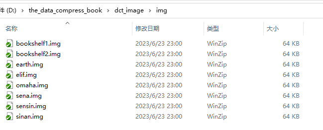
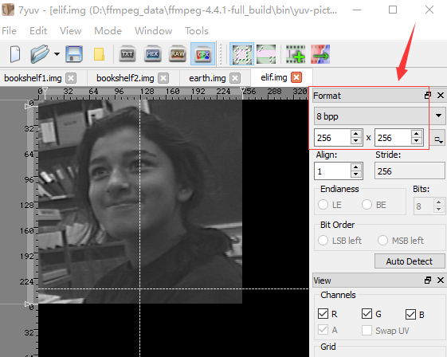

# 图像 DCT 编解码的实现
clion 的调试配置跟参考其他目录的 README

img 文件夹下是 256x256 的 8 位 采样的 灰度图像。如下：



可以使用 7yuv 查看这些图片，如下：



---

压缩图片的命令如下：

```
./dct_c bookshelf1.img encode 4
```

解压图片的命令如下：

```
./dct_e encode decode 
```

