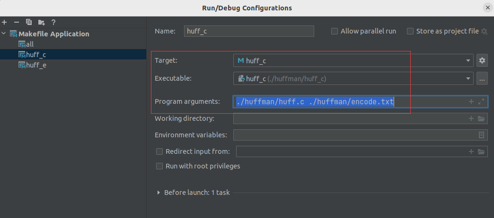
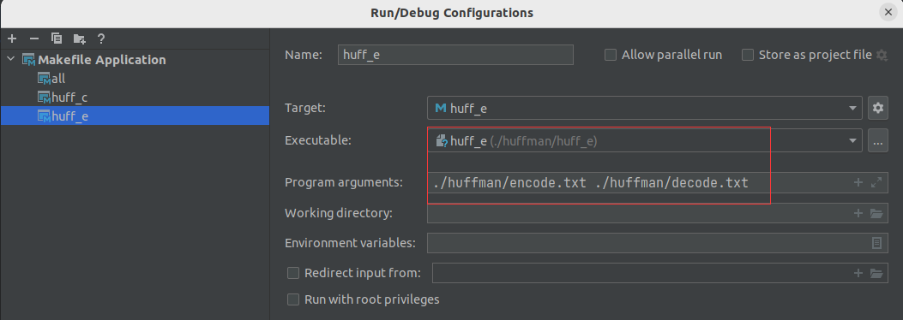

# 标准的哈夫曼编解码的实现
`huff_c` 是压缩程序，`huff_e` 是解压缩程序。

调试 `huff_c` 程序的 clion 配置如下：

```
./huffman/huff.c ./huffman/encode.txt
```



上图是把 `huff.c` 的内容进行 哈夫曼 压缩，生成 `encode.txt`。

---

调试 `huff_e`  程序的 clion 配置如下：

```
./huffman/encode.txt ./huffman/decode.txt
```



上图是把 `encode.txt`的内容进行 哈夫曼 解缩，生成 `decode.txt`。

会发现  `decode.txt` 跟 `huff.c` 的内容是一样的。

